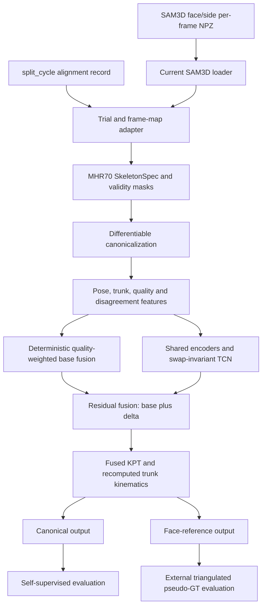

# Rotation-Aware Fusion Integration Design

## 1. 目标与研究定位

在现有双视角 3D KPT 融合实验基础上，新增一条面向论文主线的自监督、体干回旋感知融合路线。

现有 `fuse/experiment_matrix.py` 及其 9 种方法保持不变，继续作为确定性对比实验。其中 `sim3_face_stable_smooth_kpt` 是当前最强基线。新方法以 `rotation_aware_self_supervised` 作为统一实验名称，不替换或重写已有结果。

论文主线满足以下边界：

- 输入仅为 face/side 两路 SAM3D-Body 3D KPT；
- 不使用 RGB、2D KPT、相机参数、mesh、人工体干角度或真实 3D GT；
- 三角测量 pseudo-GT 只用于训练完成后的外部评价，不用于训练、伪目标构造、融合权重估计或 checkpoint 选择；
- 输出为完整 70 关节 3D KPT，而非仅输出体干角度；
- 训练和推理在人体中心 canonical 坐标中进行，并支持恢复到 face 参考坐标用于现有流程显示和比较；
- 最终报告按 person 汇总。cycle 仅用于样本构造、窗口训练和完整 ROM 判断。

## 2. 兼容原则

### 2.1 保留现有流程

以下行为不改变：

- `python -m fuse` 仍默认运行现有 9 方法实验矩阵；
- 人员仍从 `/home/data/xchen/gymnastics/sam3d_body_results/person` 发现；
- face/side 时间关系仍强制读取 `logs/split_cycle/person_<id>/alignment_record_<id>.json` 中的 `offset_side_to_face`；
- 现有 `logs/fuse_experiments/<method>/person_<id>/fused_sequence.npz` 不覆盖；
- 现有三角测量 MPJPE 评价继续可复现。

### 2.2 新主线独立落盘

新路线默认写入：

```text
logs/fuse_rotation_aware/
├── cache/
├── runs/<run_id>/
│   ├── config_resolved.yaml
│   ├── split_manifest.json
│   ├── corruption_manifest.json
│   ├── checkpoints/
│   ├── train_metrics.csv
│   └── run_metadata.json
├── inference/<run_id>/person_<id>/
│   ├── fused_sequence.npz
│   └── config.json
└── evaluation/<run_id>/
    ├── metrics_by_person.csv
    ├── metrics_by_joint.csv
    ├── corruption_metrics.csv
    ├── rotation_metrics.csv
    └── report.json
```

不会把模型训练产物写入 `logs/fuse_experiments`。统一评价时，评价器同时读取旧实验目录和新推理目录。

## 3. 总体架构



新代码位于 `fuse/rotation_aware/`，不放入分类训练模块 `project/train/`。分类 TCN 与融合 TCN 的输入、输出和研究职责不同，不共享模型类。

## 4. 当前数据到新数据契约的映射

### 4.1 原始输入

当前 SAM3D 单帧文件只有 `output` 字典，核心字段为：

- `pred_keypoints_3d`: `float32 [70,3]`；
- `frame_idx`: 原视频帧号；
- 无 `joint_names`、timestamps 和 valid mask。

适配层将构造：

```python
@dataclass(frozen=True)
class PosePairTrial:
    face: np.ndarray
    side: np.ndarray
    valid_face: np.ndarray
    valid_side: np.ndarray
    timestamps: np.ndarray
    face_map: np.ndarray
    side_map: np.ndarray
    joint_names: tuple[str, ...]
    person_id: str
    trial_id: str
    fps: float
```

其中：

- face/side shape 为 `[T,70,3]`；
- valid mask 规则为 `all(isfinite(xyz)) and not_all_zero(xyz)`；
- timestamps 根据公共时间轴和 split record 中的 fps 构造；
- joint names 来自 `fuse/metadata/mhr70.py`，并通过 SkeletonSpec 显式解析；
- `trial_id` 对应 split record 中的 cycle；
- frame map 保留原始视频帧号，供推理输出和三角测量评价使用。

### 4.2 时间对齐

主线只使用 split record 的 `offset_side_to_face`。缺少记录或字段时立即失败并报告 person id 和文件路径。

规格包中的时间戳/体干角速度 lag 估计不进入主线，可在后续作为 `alignment_ablation` 独立消融实现。它不得成为缺少 split record 时的静默 fallback。

### 4.3 Cycle 与 subject split

- split record 中每个 cycle 构成一个 trial；
- 训练窗口默认长度 128，训练 stride 32，评价 stride 64；
- 同一人的所有 cycle 必须位于同一个 train/val/test split；
- 优先复用 `/home/data/xchen/gymnastics/index_mapping/camera_pairs_by_person_folds/fold_00.json` 等现有 person-level folds，仅提取 person membership，不使用动作标签；
- 最终结果对同一人的所有有效 frame/cycle 聚合后再计算 person 指标。

## 5. MHR70 SkeletonSpec

新路线不得继续依赖散落的整数常量。`configs/fuse/skeleton_mhr70.yaml` 显式定义关节名称、骨连接、角色和 fallback。

MHR70 没有真实 `pelvis`、`chest` 或 `spine_low` 点，因此定义虚拟解剖角色：

- pelvis center：`(left_hip + right_hip) / 2`；
- thorax center：`(left_acromion + right_acromion) / 2`；
- thorax 横轴：left acromion 指向 right acromion；
- pelvis 横轴：left hip 指向 right hip；
- pelvis 纵轴提示：thorax center 减 pelvis center；
- thorax 纵轴提示：neck 减 thorax center；
- acromion 无效时，显式 fallback 到 left/right shoulder。

所有 derived role 和 fallback 都记录在预处理报告中。缺少 left/right hip、neck，或肩部两套候选都无效时，对应 frame 标为 trunk invalid，而不是猜测其它关节。

## 6. 几何与特征

### 6.1 Canonicalization

每一路独立构造骨盆局部坐标：

```text
origin = hip center
x = normalize(right hip - left hip)
y_hint = normalize(thorax center - hip center)
z = normalize(cross(x, y_hint))
y = cross(z, x)
P_canonical = R_pelvis.T @ (P - origin) / trial_scale
```

`trial_scale` 是整条 trial 的鲁棒 torso length 中位数，禁止逐帧缩放。转换保存 pelvis center、pelvis rotation、trial scale 和 frame validity，确保可逆。

### 6.2 体干运动学

胸廓相对骨盆旋转定义为：

```text
R_pt = R_pelvis.T @ R_thorax
```

网络输入使用 `R_pt` 的 6D rotation representation，以及 `sin(theta)`、`cos(theta)`、wrapped angular velocity 和 angular acceleration。融合体干角度必须从 `fused_kpts` 可微重算，不能由独立 angle head 直接作为最终值。

### 6.3 质量与分歧

质量特征包括肩宽、髋宽、torso length、胸廓/骨盆刚性残差、角加速度异常、坐标系退化和有效关节比例。质量值由固定配置权重计算，并在作为损失权重时 detach。

跨视角特征包括 canonical 坐标差、绝对坐标差、圆周角差、SO(3) 距离、thorax-pelvis 位移差、质量差和 validity pattern。

## 7. 融合模型

### 7.1 基础融合

主模型的基础结果是 canonical 坐标中的确定性质量加权平均：

```text
w_face = valid_face * quality_face
w_side = valid_side * quality_side
P_base = (w_face * P_face + w_side * P_side) / (w_face + w_side + eps)
```

当前 Sim3 方法不作为模型的 base。它作为独立 baseline 保留，以避免主线方法依赖 face 参考坐标或逐帧 Sim3 拟合。

### 7.2 网络结构

- face/side pose branch 使用同一个 shared encoder；
- face/side trunk branch 使用同一个 shared encoder；
- 两路编码通过 mean 和 absolute difference 组合，保证交换输入视角后输出不变；
- temporal backbone 使用非因果 dilated residual TCN；
- residual head 输出 `delta_kpts [B,T,70,3]`；
- 最终输出为 `P_fused = P_base + bounded_delta`；
- delta 上限按 SkeletonSpec body part 配置，所有关节均允许修正。

模型测试必须验证：输出 shape、有限梯度、`fused = base + delta`、swap error 小于 `1e-5`，以及 fused angle 来自 fused KPT。

## 8. 自监督训练

### 8.1 Synthetic corruption

第一版实现 joint dropout、temporal block dropout、spike noise、random walk drift、thorax rotation bias、freeze segment 和 integer time shift。所有 corruption 支持固定 seed，返回精确 mask，不修改原 reference，并在评价时使用固定 manifest。

### 8.2 伪目标边界

未破坏输入中：

- 两路高一致时使用质量加权共识；
- 一路质量明显更高时使用该路；
- 自然分歧大且没有质量优势时，不构造强坐标伪目标；
- 三角测量不参与伪目标。

### 8.3 分阶段训练

1. Stage A：只运行数据、几何、特征、arithmetic mean 和 quality mean；
2. Stage B：训练 mask recovery、identity、bone 和 rigidity；
3. Stage C：加入 axial rotation、SO(3)、adaptive temporal 和 minimal delta；
4. Stage D：仅对完整 cycle 窗口加入 ROM preservation。

checkpoint 依据无 GT validation score 选择，综合 corruption recovery、bone CV、rotation consistency、identity preservation 和 ROM retention，不使用 triangulated MPJPE。

## 9. 推理、输出与统一评价

### 9.1 推理输出

`fused_sequence.npz` 至少保存：

```text
kpts_world                  [T,70,3]  face reference, compatible field
kpts_body                   [T,70,3]  current unscaled body-frame convention
kpts_fused_canonical        [T,70,3]
kpts_base_canonical         [T,70,3]
theta_fused_rad             [T]
omega_fused_rad_s           [T]
quality_face                [T]
quality_side                [T]
frame_valid                 [T]
face_map                    [T]
side_map                    [T]
```

`kpts_world` 只是恢复到 face 参考坐标的兼容字段，metadata 必须标明 `coordinate_system=face_reference_uncalibrated`。`kpts_body` 继续使用现有 `kpts_world_to_body` 的未缩放语义，保证旧加载和分析代码不被 trial-scale normalization 改变；论文主线的尺度归一化结果只保存在 `kpts_fused_canonical`。

### 9.2 对比实验

统一评价至少包含：

- 现有 9 种 fuse 方法；
- face only；
- side only；
- canonical arithmetic mean；
- deterministic quality mean；
- rotation-aware self-supervised model；
- 论文定义的 A0-A6 消融。

三角测量 pseudo-GT 指标继续报告 root-normalized MPJPE、median、P95 和 joint metrics。同时报告不依赖 pseudo-GT 的 bone CV、rigidity、joint jerk、trunk angular jerk、ROM retention、peak angular velocity retention、swap error 和 fixed-corruption recovery。

论文结论不得仅根据 MPJPE 或平滑度。jerk 改善必须和 ROM、峰值速度保持一起解释。

## 10. CLI 设计

现有入口不变：

```bash
conda run -n gymnastic python -m fuse
```

新入口：

```bash
conda run -n gymnastic python -m fuse.rotation_aware prepare
conda run -n gymnastic python -m fuse.rotation_aware train
conda run -n gymnastic python -m fuse.rotation_aware infer
conda run -n gymnastic python -m fuse.rotation_aware evaluate
```

`prepare` 生成紧凑缓存和 split manifest，避免每个 epoch 重复读取数十万份单帧 NPZ。所有命令支持 `--config`、`--person`、`--fold` 和输出目录覆盖；训练和全量推理默认要求显式 run id。

## 11. 错误处理与可追溯性

- split record 缺失或 offset 缺失：person 失败，不 fallback；
- required joint role 不完整：trial 失败，并列出角色名；
- 单帧退化：frame mask 为 false，记录原因，不生成 NaN；
- 短缺失可用于特征插值，但原 mask 不改变；长缺失不作为伪目标；
- 缓存必须记录源文件范围、split record 路径、配置 hash 和代码版本；
- checkpoint 保存模型、优化器、scheduler、配置、SkeletonSpec、split hash、corruption manifest hash 和 git commit；
- 推理输出检查 shape、joint order、finite ratio 和 frame map 单调性。

## 12. 测试与质量门禁

开发遵循逐任务 TDD。每个模块先写失败测试，再实现最小代码。

测试层次：

- 数据：真实字段适配、mask、frame map、cycle 边界、subject split 无泄漏；
- 几何：平移/旋转/尺度不变性、已知 30 度回旋、圆周连续性、正交旋转、canonical round trip；
- corruption：seed 可复现、mask 精确、reference 不变；
- 模型：shape、gradient、swap invariance、residual identity；
- loss：perfect prediction、padding/invalid mask、快速运动自适应权重；
- 集成：tiny overfit、长序列 overlap inference、NPZ 输出、按人聚合评价。

现有回归测试必须持续通过：

```bash
conda run -n gymnastic python -m pytest tests/test_fuse_experiment_matrix.py -q
conda run -n gymnastic python -m pytest tests/test_sam3d_triangulation.py tests/test_compare_fused_triangulated.py -q
```

新模块增加 focused test suite。ruff 和 mypy 只逐步应用到新模块，避免第一版接入时被仓库历史代码阻塞。

## 13. 环境决策

当前 `gymnastic` 环境为 Python 3.10.20，包含 NumPy、SciPy、PyYAML 和 pytest，但没有 PyTorch、ruff 或 mypy。接入不迁移整个仓库到 Python 3.11，也不新增 Lightning 或 Hydra。

- 数据适配、manifest 和 compact cache 可先在现有环境实现；
- 可微几何阶段前安装与机器 CUDA/驱动兼容的 PyTorch，几何、模型和损失统一使用 PyTorch tensor，避免先写 NumPy 版本再重做；
- ruff 和 mypy 作为开发依赖加入，但检查范围先限制为 `fuse/rotation_aware`；
- 依赖安装是单独验收步骤，不与几何代码变更混在同一提交。

## 14. 实施顺序

1. 数据适配、SkeletonSpec 与 compact cache；
2. PyTorch 环境验证、canonicalization、逆变换与 trunk kinematics；
3. pose/quality/disagreement 特征与确定性 baselines；
4. synthetic corruption 与窗口数据集；
5. swap-invariant TCN 模型；
6. 自监督损失、训练引擎与 tiny-overfit；
7. 长序列推理、face-reference 恢复与输出兼容；
8. 统一实验矩阵、按人汇总、A0-A6 消融和论文图表。

每一步形成独立、可测试、可审查的提交。任何下一阶段都不能以破坏已有 9 方法结果或改变 split 时间偏移定义为代价。

## 15. 第一版完成标准

- 68 人均可生成有效 compact cache 或得到明确失败报告；
- known-angle、canonical round-trip 和 swap-invariance 测试通过；
- fixed corruption benchmark 可复现；
- tiny-overfit 无 NaN 且 loss 明显下降；
- 新模型输出 70 关节完整序列，frame map 与现有流程兼容；
- 全量推理和评价按 person 输出，无 cycle 级最终排名；
- 旧 9 方法与新主线可在同一报告中比较；
- checkpoint 选择不使用三角测量结果；
- 最终报告同时包含 pseudo-GT MPJPE、结构指标、corruption recovery、ROM 和峰值速度保持；
- 现有 fuse 与 triangulation 回归测试全部通过。
